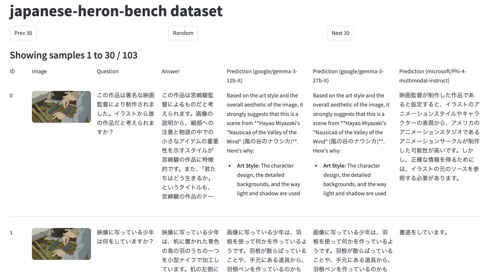

# llm-jp-eval-mm
[](https://pypi.python.org/pypi/eval-mm) [](https://github.com/llm-jp/llm-jp-eval-mm/actions/workflows/test.yml) [](https://opensource.org/licenses/Apache-2.0)

llm-jp-eval-mm is a lightweight framework for evaluating visual-language models across various benchmark tasks, mainly focusing on Japanese tasks.


## Updates

:tada:[2026.01.16] Our paper introducing `llm-jp-eval-mm`, "_Cross-Task Evaluation and Empirical Analysis of Japanese Visual Language Models_", was **accepted for publication in the Journal of Natural Language Processing** (Japan)!


## Getting Started

You can install llm-jp-eval-mm from GitHub or via PyPI.

- Option 1: Clone from GitHub (Recommended)
```bash
git clone git@github.com:llm-jp/llm-jp-eval-mm.git
cd llm-jp-eval-mm
uv sync
```

- Option 2: Install via PyPI
```bash
pip install eval_mm
```

To use LLM-as-a-Judge, configure your OpenAI API keys in a`.env` file:
- For Azure: Set `AZURE_OPENAI_ENDPOINT` and `AZURE_OPENAI_KEY`
- For OpenAI: Set `OPENAI_API_KEY`

If you are not using LLM-as-a-Judge, you can assign any value in the `.env` file to bypass the error.

## Usage

To evaluate a model on a task, use the `eval-mm` CLI:
```bash
uv sync --group normal
uv run --group normal eval-mm run \
  --model_id llava-hf/llava-1.5-7b-hf \
  --task_id japanese-heron-bench  \
  --result_dir result  \
  --metrics heron-bench \
  --judge_model gpt-4o-2024-11-20 \
  --overwrite
```

You can also use `python -m eval_mm run ...` or the legacy `python examples/sample.py ...` wrapper.

To evaluate using vLLM for faster batch inference:
```bash
uv sync --group vllm_normal
uv run --group vllm_normal eval-mm run \
  --backend vllm \
  --model_id Qwen/Qwen2.5-VL-3B-Instruct \
  --task_id japanese-heron-bench \
  --metrics heron-bench
```

To score existing predictions without running inference:
```bash
eval-mm evaluate --model_id llava-hf/llava-1.5-7b-hf --task_id japanese-heron-bench --metrics heron-bench
```

To list available tasks and metrics:
```bash
eval-mm list tasks
eval-mm list metrics
```

The evaluation results will be saved in the result directory:
```
result
├── japanese-heron-bench
│   ├── llava-hf
│   │   ├── llava-1.5-7b-hf
│   │   │   ├── evaluation.jsonl
│   │   │   └── prediction.jsonl
```

To evaluate multiple models on multiple tasks, please check `eval_all.sh`.

## Hello World Example

You can integrate llm-jp-eval-mm into your own code. Here's an example:
```python
from PIL import Image
from eval_mm import TaskRegistry, ScorerRegistry, ScorerConfig

class MockVLM:
    def generate(self, images: list[Image.Image], text: str) -> str:
        return "宮崎駿"

task = TaskRegistry.load_task("japanese-heron-bench")
example = task.dataset[0]

input_text = task.doc_to_text(example)
images = task.doc_to_visual(example)
reference = task.doc_to_answer(example)

model = MockVLM()
prediction = model.generate(images, input_text)

scorer = ScorerRegistry.load_scorer(
    "rougel",
    ScorerConfig(docs=task.dataset)
)
result = scorer.aggregate(scorer.score([reference], [prediction]))
print(result)
# AggregateOutput(overall_score=5.128205128205128, details={'rougel': 5.128205128205128})
```


## Web Dashboard

A Next.js web frontend provides three interactive views for browsing evaluation results. It connects to a lightweight FastAPI backend that serves data from your `result/` directory.

### Quick Start

```bash
# Terminal 1: Start the API server
uv pip install fastapi uvicorn
uvicorn eval_mm.api:app --reload

# Terminal 2: Start the web frontend
cd web
pnpm install
pnpm dev
```

Then open http://localhost:3000.

### Pages

| Page | URL | Description |
|------|-----|-------------|
| **Runner Dashboard** | `/runner` | GPU monitoring, task configuration, progress tracking (Sentry-inspired dark UI) |
| **Leaderboard** | `/leaderboard` | Sortable model comparison table with scores across all tasks (Stripe-inspired design) |
| **Prediction Browser** | `/browser` | Browse individual predictions, compare models side-by-side, navigate samples (Claude-inspired editorial UI) |

### API Endpoints

The FastAPI backend (`uvicorn eval_mm.api:app`) exposes:

| Endpoint | Description |
|----------|-------------|
| `GET /api/tasks` | List available evaluation tasks |
| `GET /api/models` | List leaderboard models |
| `GET /api/results` | Discover all task/model result pairs |
| `GET /api/predictions/{task_id}/{model_id}` | Paginated predictions (supports `offset`, `limit`) |
| `GET /api/scores/{task_id}` | Aggregate scores for all models on a task |

Set `EVAL_MM_RESULT_DIR` to point to your result directory (default: `result/`).

> **Note**: The web frontend works without the API server — pages fall back to mock data for static builds and development.

### Static Build

```bash
cd web && pnpm build
```

This generates static pages that can be deployed to GitHub Pages or any static host.

## Leaderboard (CLI)

To generate a leaderboard from your evaluation results via CLI:
```bash
python scripts/make_leaderboard.py --result_dir result
```

This will create a `leaderboard.md` file with your model performance:

| Model                                    | Heron/LLM | JVB-ItW/LLM | JVB-ItW/Rouge |
| :--------------------------------------- | :-------- | :---------- | :------------ |
| llm-jp/llm-jp-3-vila-14b                 | 68.03     | 4.08        | **52.4**      |
| Qwen/Qwen2.5-VL-7B-Instruct              | 70.29     | 4.28        | 29.63         |
| google/gemma-3-27b-it                    | 69.15     | 4.36        | 30.89         |
| microsoft/Phi-4-multimodal-instruct      | 45.52     | 3.2         | 26.8          |
| gpt-4o-2024-11-20                        | **93.7**  | **4.44**    | 32.2          |

The official leaderboard is available [here](https://llm-jp.github.io/llm-jp-eval-mm/)

> [!NOTE]
> Multi-image tasks — **JDocQA**, **JA-Multi-Image-VQA**, **JMMMU**, and
> **MMMU** — may appear blank for models that only accept a single image
> per prompt (e.g. LLaVA-1.6, Pangea, Aya-Vision, older Ovis2). Those
> cells are structural gaps from inference, not scoring failures.

## Supported Tasks

Japanese Tasks:
- [Japanese Heron Bench](https://huggingface.co/datasets/turing-motors/Japanese-Heron-Bench)
- [JA-VG-VQA-500](https://huggingface.co/datasets/SakanaAI/JA-VG-VQA-500)
- [JA-VLM-Bench-In-the-Wild](https://huggingface.co/datasets/SakanaAI/JA-VLM-Bench-In-the-Wild)
- [JA-Multi-Image-VQA](https://huggingface.co/datasets/SakanaAI/JA-Multi-Image-VQA)
- [JDocQA](https://github.com/mizuumi/JDocQA)
- [JMMMU](https://huggingface.co/datasets/JMMMU/JMMMU)
- [MECHA-ja](https://huggingface.co/datasets/llm-jp/MECHA-ja)
- [CC-OCR](https://huggingface.co/datasets/wulipc/CC-OCR) (multi_lan_ocr split, ja subset)
- [jawildtext-board-vqa / handwriting-ocr / receipt-kie](https://huggingface.co/datasets/llm-jp/jawildtext)
- [CVQA](https://huggingface.co/datasets/afaji/cvqa) (ja subset)

English Tasks:
- [MMMU](https://huggingface.co/datasets/MMMU/MMMU)
- [LlaVA-Bench-In-the-Wild](https://huggingface.co/datasets/lmms-lab/llava-bench-in-the-wild)
- [OK-VQA](https://okvqa.allenai.org/)
- [TextVQA](https://huggingface.co/datasets/lmms-lab/textvqa)
- [AI2D](https://huggingface.co/datasets/lmms-lab/ai2d)
- [ChartQA](https://huggingface.co/datasets/lmms-lab/ChartQA)
- [ChartQAPro](https://huggingface.co/datasets/ahmed-masry/ChartQAPro)
- [DocVQA](https://huggingface.co/datasets/lmms-lab/DocVQA)
- [InfoVQA (infographicvqa)](https://huggingface.co/datasets/lmms-lab/infographicvqa)

## Managing Dependencies

We use uv’s dependency groups to manage each model’s dependencies.

For example, to use llm-jp/llm-jp-3-vila-14b, run:
```bash
uv sync --group vilaja
uv run --group vilaja python examples/VILA_ja.py
```

See `eval_all.sh` for the complete list of model dependencies.

When adding a new group, remember to configure [conflict](https://docs.astral.sh/uv/concepts/projects/config/#conflicting-dependencies).

## Browse Predictions

### Web UI (Recommended)
Start the web dashboard (see [Web Dashboard](#web-dashboard) above) and open the **Prediction Browser** at http://localhost:3000/browser.

### Streamlit (Legacy)
```bash
uv run streamlit run scripts/browse_prediction.py -- --task_id japanese-heron-bench --result_dir result --model_list llava-hf/llava-1.5-7b-hf
```




## Development

### Adding a new task

To add a new task, implement the Task class in `src/eval_mm/tasks/task.py`.

### Adding a new metric

To add a new metric, implement the Scorer class in `src/eval_mm/metrics/scorer.py`.

### Adding a new model

To add a new model, create a VLM adapter class that inherits from `eval_mm.BaseVLM` and place it in `examples/`.
Register it in `examples/model_table.py` so the CLI can discover it.

> **Note**: `examples/` contains *model adapter implementations* and *usage examples*.
> The evaluation engine, CLI, base classes, and scoring live in `src/eval_mm/` (the published package).
> Model adapters in `examples/` are not part of the PyPI distribution — they are reference implementations
> for users to copy, adapt, or extend

### Adding a new dependency

Install a new dependency using the following command:
```bash
uv add <package_name>
uv add --group <group_name> <package_name>
```


### Testing

Portable offline tests (no GPU, no network):
```bash
bash test.sh
```

Model smoke tests (requires GPU + model weights):
```bash
bash test_model.sh                  # all models
bash test_model.sh "Qwen"          # filter by name
CUDA_VISIBLE_DEVICES=0,1 bash test_model.sh  # custom GPU selection
```

### Formatting and Linting

Ensure code consistency with:
```bash
uv run ruff format src
uv run ruff check --fix src
```

### Releasing to PyPI

To release a new version:
```bash
git tag -a v0.x.x -m "version 0.x.x"
git push origin --tags
```


### Updating the Website

The web dashboard is built with Next.js in the `web/` directory. For development:
```bash
cd web && pnpm dev
```

The legacy GitHub Pages leaderboard is in `github_pages/`. To update its data:
```bash
python scripts/make_leaderboard.py --update_pages
```

## Environment-Specific Configuration (mdx)

This project runs on [mdx](https://mdx.jp/) (a GPU computing platform for academic research in Japan). The devcontainer is pre-configured for this environment.

### Storage Layout on mdx

| Mount | Filesystem | Capacity | Purpose |
|-------|-----------|----------|---------|
| `/workspace` | NFS (`/home/$USER/workspace/evalmm`) | ~6T (shared) | Source code, results, datasets |
| `/model` | Lustre (`/model`) | ~4P | Model weights, HF/uv/vLLM caches |

### Cache Configuration

Large caches (HuggingFace models, uv packages, vLLM compilations) are stored on `/model` to avoid filling the NFS home directory. This is configured in `.devcontainer/docker-compose.yml`:

```yaml
volumes:
  - /model:/model:cached
environment:
  HF_HOME: /model/<username>/cache/huggingface
  UV_CACHE_DIR: /model/<username>/cache/uv
  VLLM_CACHE_DIR: /model/<username>/cache/vllm
```

Before rebuilding the devcontainer, create the cache directories on the host:
```bash
mkdir -p /model/$USER/cache/{huggingface,uv,vllm}
```

### Running on Other Environments

If you are **not** using mdx, remove or comment out the `/model` volume mount and the cache environment variables in `.devcontainer/docker-compose.yml`. Caches will fall back to their default locations (`~/.cache/`).

## Acknowledgements
- [Heron](https://github.com/turingmotors/heron): We refer to the Heron code for the evaluation of the Japanese Heron Bench task.
- [lmms-eval](https://github.com/EvolvingLMMs-Lab/lmms-eval): We refer to the lmms-eval code for the evaluation of the JMMMU and MMMU tasks.

We also thank the developers of the evaluation datasets for their hard work.

## Citation

```bibtex
@article{maeda-etal-2026-evalmm,
  title = {日本語視覚言語モデルのタスク横断評価と実証的分析},
  author = {前田 航希 and 
    杉浦 一瑳 and 
    小田 悠介 and 
    栗田 修平 and 
    岡崎 直観},
  journal={自然言語処理},
  volume={33},
  number={2},
  pages={TBD},
  year={2026},
  note = {local.ja},
  month = {January}
}

@article{maeda-etal-2026-evalmm-en,
  title = {Cross-Task Evaluation and Empirical Analysis of Japanese Visual Language Models},
  author = {Koki Maeda and
    Issa Sugiura and
    Yusuke Oda and
    Shuhei Kurita and
    Naoaki Okazaki},
  journal = {自然言語処理},
  volume = {33},
  number = {2},
  pages = {TBD},
  year = {2026},
  note = {local.en},
  month = {January}
}
```

