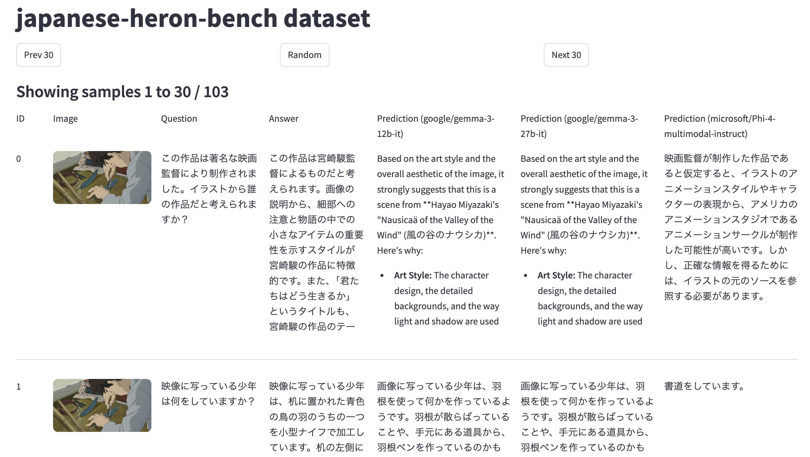

# llm-jp-eval-mm
[](https://pypi.python.org/pypi/eval-mm) [](https://github.com/llm-jp/llm-jp-eval-mm/actions/workflows/test.yml) [](https://opensource.org/licenses/Apache-2.0)

[ [**Japanese**](./README_ja.md) | English ]

llm-jp-eval-mm automates the evaluation of multi-modal large language models (VLMs) across various datasets, mainly focusing on Japanese tasks.

This tool supports multi-modal text generation tasks and calculates task-specific evaluation metrics based on the inference results provided by users.


## Table of Contents

- [llm-jp-eval-mm](#llm-jp-eval-mm)
  - [Table of Contents](#table-of-contents)
  - [Getting Started](#getting-started)
  - [How to Evaluate](#how-to-evaluate)
    - [Running an Evaluation](#running-an-evaluation)
    - [Use llm-jp-eval-mm as a Library](#use-llm-jp-eval-mm-as-a-library)
    - [Leaderboard](#leaderboard)
  - [Supported Tasks](#supported-tasks)
  - [Required Libraries for Each VLM Model Inference](#required-libraries-for-each-vlm-model-inference)
  - [Benchmark-Specific Required Libraries](#benchmark-specific-required-libraries)
  - [Analyze VLMs Prediction](#analyze-vlms-prediction)
  - [Contribution](#contribution)
    - [How to Add a Benchmark Task](#how-to-add-a-benchmark-task)
    - [How to Add a Metric](#how-to-add-a-metric)
    - [How to Add Inference Code for a VLM Model](#how-to-add-inference-code-for-a-vlm-model)
    - [How to Add Dependencies](#how-to-add-dependencies)
    - [Testing](#testing)
    - [Formatting and Linting with Ruff](#formatting-and-linting-with-ruff)
    - [Releasing to PyPI](#releasing-to-pypi)
    - [Updating the Website](#updating-the-website)
  - [Acknowledgements](#acknowledgements)

## Getting Started

You can install llm-jp-eval-mm from GitHub or via PyPI.

- Option 1: Clone from GitHub (Recommended)
```bash
git clone git@github.com:llm-jp/llm-jp-eval-mm.git
cd llm-jp-eval-mm
uv sync
```

- Option 2: Install via PyPI
```bash
pip install eval_mm
```

This tool uses the LLM-as-a-judge method for evaluation, which sends requests to GPT-4o via the OpenAI API.
You need to configure the API keys in a .env file:
- For Azure:`AZURE_OPENAI_ENDPOINT` and `AZURE_OPENAI_KEY`
- For OpenAI: `OPENAI_API_KEY`


## How to Evaluate

### Running an Evaluation

To evaluate your model on a specific task, we provide an example script: `examples/sample.py`.

For example, to evaluate the `llava-hf/llava-1.5-7b-hf` model on the japanese-heron-bench task, run:

```bash
uv sync --group normal
uv run --group normal python examples/sample.py \
  --model_id llava-hf/llava-1.5-7b-hf \
  --task_id japanese-heron-bench  \
  --result_dir result  \
  --metrics "heron-bench" \
  --judge_model "gpt-4o-2024-11-20" \
  --overwrite
```

The evaluation results will be saved in the result directory:
```
├── japanese-heron-bench
│   ├── llava-hf
│   │   ├── llava-1.5-7b-hf
│   │   │   ├── evaluation.jsonl
│   │   │   └── prediction.jsonl
```

If you want to evaluate multiple models on multiple tasks, please check `eval_all.sh`.


### Use llm-jp-eval-mm as a Library

You can also integrate llm-jp-eval-mm into your own code. Here's an example:
```python
from PIL import Image
from eval_mm import TaskRegistry, ScorerRegistry, ScorerConfig

class MockVLM:
    def generate(self, images: list[Image.Image], text: str) -> str:
        return "宮崎駿"

task = TaskRegistry.load_task("japanese-heron-bench")
example = task.dataset[0]

input_text = task.doc_to_text(example)
images = task.doc_to_visual(example)
reference = task.doc_to_answer(example)

model = MockVLM()
prediction = model.generate(images, input_text)

scorer = ScorerRegistry.load_scorer(
    "rougel",
    ScorerConfig(docs=task.dataset)
)
result = scorer.aggregate(scorer.score([reference], [prediction]))
print(result)
# AggregateOutput(overall_score=5.128205128205128, details={'rougel': 5.128205128205128})
```

### Leaderboard

To generate a leaderboard from your evaluation results, run:
```bash
python scripts/make_leaderboard.py --result_dir result
```

This will create a `leaderboard.md` file with your model performance:

| Model                                    | Heron/LLM | JVB-ItW/LLM | JVB-ItW/Rouge |
| :--------------------------------------- | :-------- | :---------- | :------------ |
| llm-jp/llm-jp-3-vila-14b                 | 68.03     | 4.08        | **52.4**      |
| Qwen/Qwen2.5-VL-7B-Instruct              | 70.29     | 4.28        | 29.63         |
| google/gemma-3-27b-it                    | 69.15     | 4.36        | 30.89         |
| microsoft/Phi-4-multimodal-instruct      | 45.52     | 3.2         | 26.8          |
| gpt-4o-2024-11-20                        | **93.7**  | **4.44**    | 32.2          |


The official leaderboard is available [here](https://llm-jp.github.io/llm-jp-eval-mm/)

## Supported Tasks

Currently, the following benchmark tasks are supported:

Japanese Tasks:
- [Japanese Heron Bench](https://huggingface.co/datasets/turing-motors/Japanese-Heron-Bench)
- [JA-VG-VQA500](https://huggingface.co/datasets/SakanaAI/JA-VG-VQA-500)
- [JA-VLM-Bench-In-the-Wild](https://huggingface.co/datasets/SakanaAI/JA-VLM-Bench-In-the-Wild)
- [JA-Multi-Image-VQA](https://huggingface.co/datasets/SakanaAI/JA-Multi-Image-VQA)
- [JDocQA](https://github.com/mizuumi/JDocQA)
- [JMMMU](https://huggingface.co/datasets/JMMMU/JMMMU)
- [JIC-VQA](https://huggingface.co/datasets/line-corporation/JIC-VQA)
- [MECHA-ja](https://huggingface.co/datasets/llm-jp/MECHA-ja)

English Tasks:
- [MMMU](https://huggingface.co/datasets/MMMU/MMMU)
- [LlaVA-Bench-In-the-Wild](https://huggingface.co/datasets/lmms-lab/llava-bench-in-the-wild)

## Required Libraries for Each VLM Model Inference

Each VLM model may have different dependencies.
To manage these, llm-jp-eval-mm uses uv's dependency groups.

For example, to use llm-jp/llm-jp-3-vila-14b, run:
```bash
uv sync --group vilaja
uv run --group vilaja python examples/VILA_ja.py
```

Refer to eval_all.sh for a full list of model dependencies.

When you add a new group, don’t forget to configure [conflict](https://docs.astral.sh/uv/concepts/projects/config/#conflicting-dependencies).

## Benchmark-Specific Required Libraries

- JIC-VQA

For the JIC-VQA dataset, you need to download images from URLs. Use the following script to prepare the dataset:

```python
python scripts/prepare_jic_vqa.py
```

## Analyze VLMs Prediction

Visualize your model’s predictions with the following Streamlit app:
```bash
uv run streamlit run scripts/browse_prediction.py --task_id "japanese-heron-bench" --result_dir "result"
```
You will be able to see the visualized predictions, like this:



## Contribution

We welcome contributions! If you encounter issues, or if you have suggestions or improvements, please open an issue or submit a pull request.

### How to Add a Benchmark Task
Refer to the `src/eval_mm/tasks` directory to implement new benchmark tasks.

### How to Add a Metric
To add new metrics, implement them in the Scorer class. The code for existing scorers can be found in `src/eval_mm/metrics`.

### How to Add Inference Code for a VLM Model
Implement the inference code for VLM models in the VLM class. For reference, check `examples/base_vlm.py`.

### How to Add Dependencies
To add a new dependency, run:
```
uv add <package_name>
uv add --group <group_name> <package_name>
```


### Testing

Run the following commands to test the task classes and metrics and to test the VLM models:
```bash
bash test.sh
bash test_model.sh
```

### Formatting and Linting with Ruff
```
uv run ruff format src
uv run ruff check --fix src
```

### Releasing to PyPI
To release a new version to PyPI:
```
git tag -a v0.x.x -m "version 0.x.x"
git push origin --tags
```


### Updating the Website
For website updates, refer to the [github_pages/README.md](./github_pages/README.md).

## Acknowledgements
- [Heron](https://github.com/turingmotors/heron): We refer to the Heron code for the evaluation of the Japanese Heron Bench task.
- [lmms-eval](https://github.com/EvolvingLMMs-Lab/lmms-eval): We refer to the lmms-eval code for the evaluation of the JMMMU and MMMU tasks.

We also thank the developers of the evaluation datasets for their hard work.
